- Observations
	- I didn't read properly what the year column is, I thought it was the year model of the car, but it would have indicated so if it was, it actually is the year the car was sold.
	- With this in mind, my analysis will revolve around the relationships between engine, transmission, and selling prices.
	- I will filter my dataset through a common seller type, owner type, fuel, and number of seats.
- The IQR formulas are used on filtered data, the filters being
	- fuel = 'Diesel'
	- seller_type = 'Individual'
	- owner = 'First_Owner'
	- seats = 5
- Below are the visualizations from the analysis phase
	- *Interactive dashboard summarizing key metrics and trends across transmission, price, and kilometrage.*
	-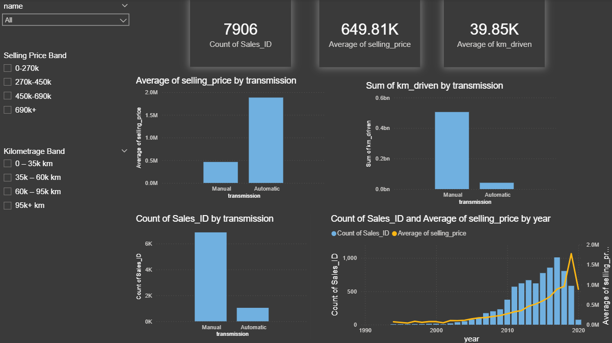
	- km_driven
		- 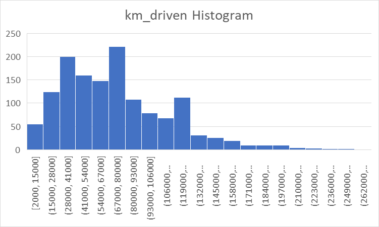
		- The distribution for km_driven is right-skewed.
	- selling_price
		- 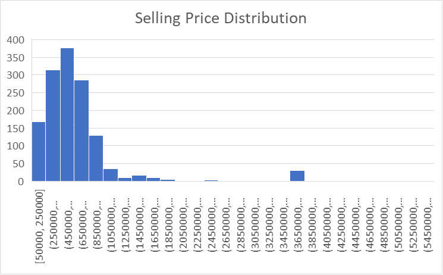{:height 470, :width 745}
		- The distribution for selling_price is right-skewed.
- The data is grouped by engine and filtered by fuel, seller, owner type, and seats. The aim is to completely isolate the huge differences in price by filtering the fuel, vehicle size by filtering the amount of seats, owner types to first owner so that extremely cheap prices from 3rd owners wouldn't be included, and a standard seller. With this, transmission and the engine are fully focused on with standardized dimensions.
	- SQL query
		- SELECT
		  	engine,
		  	COUNT (CASE WHEN transmission = 'Manual' 
		  		   AND selling_price < 1320000 
		  		   AND km_driven < 186062.5
		  		   THEN 1 END) AS manual_count,
		  	COUNT (CASE WHEN transmission = 'Automatic' 
		  		   AND selling_price < 1320000 
		  		   AND km_driven < 186062.5
		  		   THEN 1 END) AS automatic_count,
		  	ROUND(AVG(km_driven) FILTER (
		  		WHERE km_driven < 186062.5
		  		AND transmission = 'Manual'), 2) AS avg_manual_km_driven,
		  	ROUND(AVG(km_driven) FILTER (
		  		WHERE km_driven < 186062.5
		  		AND transmission = 'Automatic'), 2) AS avg_automatic_km_driven,
		  	ROUND(AVG(selling_price) FILTER (
		  		WHERE selling_price < 1320000
		  		AND transmission = 'Manual'), 2) AS avg_manual_price,
		  	ROUND(AVG(selling_price) FILTER (
		  		WHERE selling_price < 1320000
		  		AND transmission = 'Automatic'), 2) AS avg_automatic_price,
		  	ROUND(AVG(mileage::numeric) FILTER (
		  		WHERE selling_price < 1320000
		  		AND transmission = 'Manual'), 2) AS avg_manual_mileage,
		  	ROUND(AVG(mileage::numeric) FILTER (
		  		WHERE selling_price < 1320000
		  		AND transmission = 'Automatic'), 2) AS avg_automatic_mileage
		  FROM car_data_raw
		  WHERE
		  	fuel = 'Diesel'
		  	AND seller_type = 'Individual'
		  	AND owner  = 'First_Owner'
		  	AND seats = 5
		  GROUP BY engine
		  HAVING
		  	COUNT (CASE WHEN transmission = 'Manual' 
		  			   AND selling_price < 1320000 
		  		   	   AND km_driven < 186062.5
		  		       THEN 1 END) >= 1
		  	AND COUNT (CASE WHEN transmission = 'Automatic'
		  			   AND selling_price < 1320000 
		  		   	   AND km_driven < 186062.5
		  		       THEN 1 END) >= 1
		  ORDER BY engine;
	- 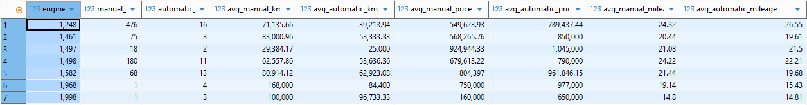
	- SQL query
		- SELECT
		  	year,
		  	engine,
		  	COUNT (CASE WHEN transmission = 'Manual' 
		  		   AND selling_price < 1320000 
		  		   AND km_driven < 186062.5
		  		   THEN 1 END) AS manual_count,
		  	COUNT (CASE WHEN transmission = 'Automatic' 
		  		   AND selling_price < 1320000 
		  		   AND km_driven < 186062.5
		  		   THEN 1 END) AS automatic_count,
		  	ROUND(AVG(km_driven) FILTER (
		  		WHERE km_driven < 186062.5
		  		AND transmission = 'Manual'), 2) AS avg_manual_km_driven,
		  	ROUND(AVG(km_driven) FILTER (
		  		WHERE km_driven < 186062.5
		  		AND transmission = 'Automatic'), 2) AS avg_automatic_km_driven,
		  	ROUND(AVG(selling_price) FILTER (
		  		WHERE selling_price < 1320000
		  		AND transmission = 'Manual'), 2) AS avg_manual_price,
		  	ROUND(AVG(selling_price) FILTER (
		  		WHERE selling_price < 1320000
		  		AND transmission = 'Automatic'), 2) AS avg_automatic_price,
		  	ROUND(AVG(mileage::numeric) FILTER (
		  		WHERE selling_price < 1320000
		  		AND transmission = 'Manual'), 2) AS avg_manual_mileage,
		  	ROUND(AVG(mileage::numeric) FILTER (
		  		WHERE selling_price < 1320000
		  		AND transmission = 'Automatic'), 2) AS avg_automatic_mileage
		  FROM car_data_raw
		  WHERE
		  	fuel = 'Diesel'
		  	AND seller_type = 'Individual'
		  	AND owner  = 'First_Owner'
		  	AND seats = 5
		  GROUP BY engine, year
		  HAVING
		  	COUNT (CASE WHEN transmission = 'Manual' 
		  			   AND selling_price < 1320000 
		  		   	   AND km_driven < 186062.5
		  		       THEN 1 END) >= 1
		  	AND COUNT (CASE WHEN transmission = 'Automatic'
		  			   AND selling_price < 1320000 
		  		   	   AND km_driven < 186062.5
		  		       THEN 1 END) >= 1
		  ORDER BY engine, year;
	- For the table below, I added year as a category to compare prices and year for engines. With this, I want to see the trend of the prices for both automatic and manual cars.
	- 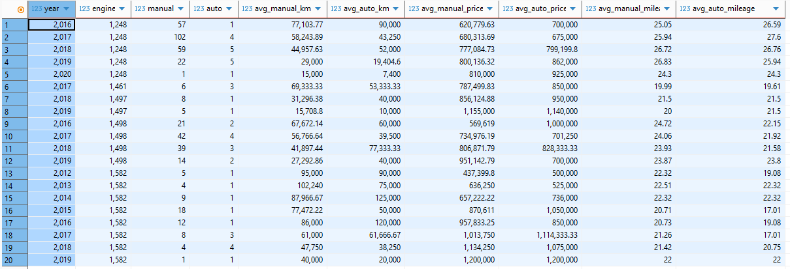
- Analysis
	- Transmission
		- Transmission selling price comparison
		  
			- 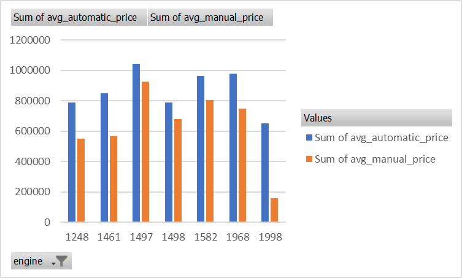
			- Regardless of engine, Automatic transmission cars were more expensive than their manual transmission counterparts. The average difference between the transmission is 38.27%, the smallest difference between them being 12.19%, and the biggest difference being 120.99%.
		- Transmission km driven comparison
			- 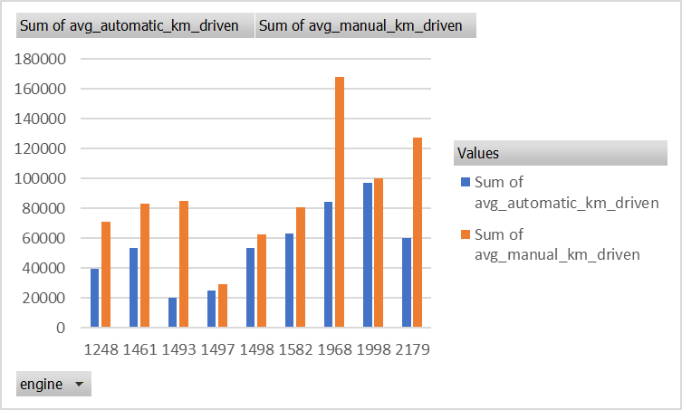
			- Regardless of engine, Manual transmission cars had more kilometrage than their automatic car counterparts. The average difference between the transmission is 47.01%, the smallest difference between them being 3.32%, and the biggest difference being 123.81%.
		- Transmissions' price comparison by km driven
			- 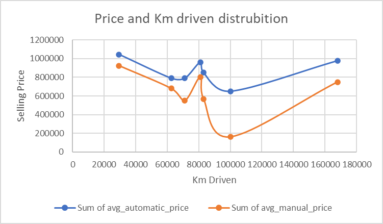
			- Automatic car prices are more expensive across all kilometers driven.
		- Selling prices are consistently higher on automatic transmission cars for every engine while kilometrage is consistently higher on manual transmission cars for every engine.
	- Engine
		- For engine analysis, I added a manual transmission filter. Automatic cars are far fewer and more expensive which may greatly affect the selling price data.
		- Engine vs Selling Price
			- 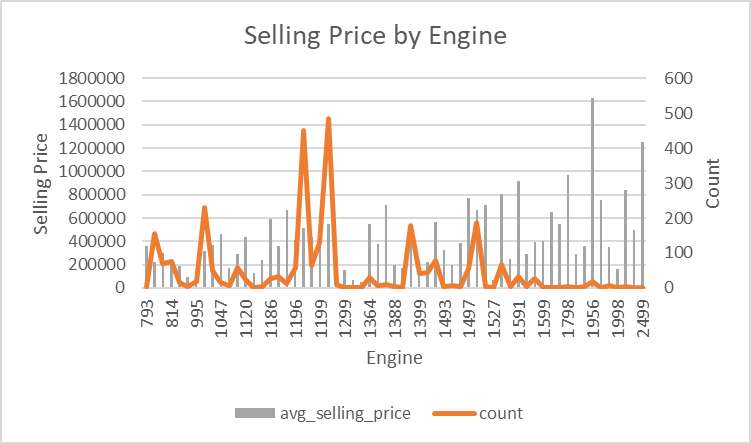{:height 415, :width 689}
			- Higher engine displacement generally corresponds to a higher the selling price. This was the trend for engines 793 up to 1199, where the car counts are relatively high.
			- The trend continues for 1388 and 1497, when disregarding the engines in between as they have low counts.
			- Price dips commonly occur when there are low car counts.
			- Engines that maintain their prices with increasing kilometrage are 1248, 1364, 1396, 1461, 1582. These
		- Engine vs Km Driven
			- 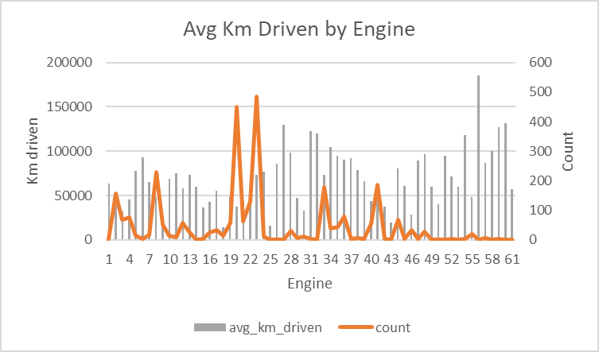
			- No trend seems to exist between Average km driven and Engine. Engine displacement does not seem to affect km driven for cars.
		- Engine vs Miles Per Gallon
			- 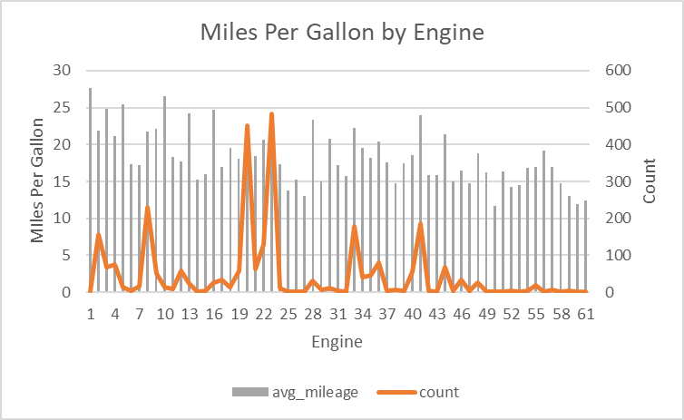
			- A higher engine displacement corresponds to lower miles per gallon.
	- A higher engine displacement is associated with higher selling prices and lower miles per gallon, while not having a trend with kilometrage.
