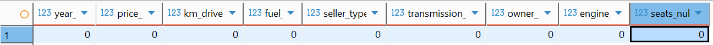
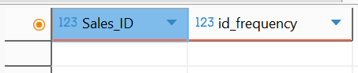
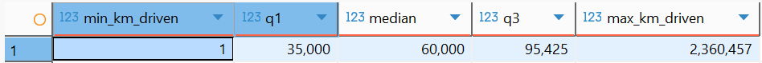
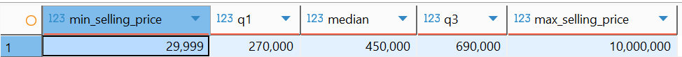

- Null checks
	- select 
	  	count(\*) filter (where year is null) as year_null,
	  	count(\*) filter (where selling_price is null) as price_null,
	  	count(\*) filter (where km_driven is null) as km_driven_null,
	  	count(\*) filter (where fuel is null) as fuel_null,
	  	count(\*) filter (where seller_type is null) as seller_type_null,
	  	count(\*) filter (where transmission is null) as transmission_null,
	  	count(\*) filter (where owner is null) as owner_null,
	  	count(\*) filter (where engine is null) as engine_null,
	  	count(\*) filter (where seats is null) as seats_null
	  from car_data_raw;
	- 
	- All columns required for analysis contain no nulls, no dropping of columns are needed.
- Typography checks
	- Text for fuel, seller_type, transmission, and owner are standardized. All are uniformly spelled.
- Duplicate checks
	- I checked if there are duplicated through the Sales_ID column
	- select 
	  	"Sales_ID",
	  	count(*) as id_frequency
	  from car_data_raw
	  group by "Sales_ID"
	  having count(*) > 1
	  order by id_frequency;
	- 
	- There are no duplicate Sales_ID values; therefore, no rows were dropped.
- Outlier checks
	- km_driven
		- SELECT
		  	MIN(km_driven) AS min_km_driven,
		  	PERCENTILE_CONT(0.25) WITHIN GROUP (ORDER BY km_driven) AS q1,
		  	PERCENTILE_CONT(0.5) WITHIN GROUP (ORDER BY km_driven) AS median,
		  	PERCENTILE_CONT(0.75) WITHIN GROUP (ORDER BY km_driven) AS q3,
		  	MAX(km_driven) AS max_km_driven
		  FROM car_data_raw;
		- 
		- IQR = Q3 - Q1
		  IQR = 95,425 - 35,000 = **60,425**
		- Q1 - 1.5 * IQR
		  35,000 - 1.5 * 60,425 = **-55,637.5**
		- Q3 + 1.5 * IQR
		  95,425 + 1.5 * 60,425 = **186,062.5**
		- No lower outlier
		- 186,062.5 is the upper outlier
		- Only the upper outlier is included, the outliers has been excluded in the analysis.
	- selling_price
		- SELECT
		  	MIN(selling_price) AS min_selling_price,
		  	PERCENTILE_CONT(0.25) WITHIN GROUP (ORDER BY selling_price) AS q1,
		  	PERCENTILE_CONT(0.5) WITHIN GROUP (ORDER BY selling_price) AS median,
		  	PERCENTILE_CONT(0.75) WITHIN GROUP (ORDER BY selling_price) AS q3,
		  	MAX(selling_price) AS max_selling_price
		  FROM car_data_raw;
		- 
		- IQR = Q3 - Q1
		  IQR = 690,00 - 270,000 = **420,000**
		- Q1 - 1.5 * IQR
		  270,000 - 1.5 * 420,000 = **-360,000**
		- Q3 + 1.5 * IQR 
		  690,000 + 1.5 * 420,000 = **1,320,000**
		- 1,320,000 is the upper outlier.
		- Only the upper outlier is included, the outliers has been excluded in the analysis.
