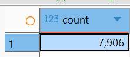

- Dataset link: https://www.kaggle.com/datasets/shubham1kumar/usedcar-data
- The dataset contains 7,906 rows and 18 columns.
  collapsed:: true
	- SELECT count(\*)
	  from car_data_raw;
	- 
- The dataset's columns are:
  collapsed:: true
	- Sales_ID
	- name
	- year
	- selling_price
	- km_driven
	- Region
	- State or Province
	- City
	- fuel
	- seller_type
	- transmission
	- owner
	- mileage
	- engine
	- max_power
	- torque
	- seats
	- sold
- Dimension checks
  collapsed:: true
	- Categories
	  collapsed:: true
		- year
		  collapsed:: true
			- SELECT
			  	year,
			  	COUNT(\*)
			  FROM car_data_raw
			  GROUP BY year
			  ORDER BY year;
			- 
			- {:height 301, :width 357}
			- Years 1994-2020 are included in the dataset.
			- **Top 5 with most counts:**
			  SELECT
			  	year,
			  	count(*)
			  FROM car_data_raw
			  GROUP BY year
			  ORDER BY count(*) desc
			  limit 5;
			- 
		- fuel
		  collapsed:: true
			- SELECT
			  	fuel AS fuel_type,
			  	COUNT(\*)
			  FROM car_data_raw
			  GROUP BY fuel
			  ORDER BY COUNT(\*);
			- 
		- seller_type
		  collapsed:: true
			- SELECT
			  	seller_type,
			  	COUNT(\*)
			  from car_data_raw
			  GROUP BY seller_type
			  ORDER BY COUNT(*);
			- 
		- transmission
		  collapsed:: true
			- SELECT
			  	transmission,
			  	COUNT(\*)
			  FROM car_data_raw
			  GROUP BY transmission
			  ORDER BY COUNT(\*);
			- 
		- owner_type
		  collapsed:: true
			- SELECT
			  	owner AS owner_type,
			  	COUNT(\*)
			  FROM car_data_raw
			  GROUP BY owner
			  ORDER BY COUNT(*);
			- 
		- engine
		  collapsed:: true
			- SELECT
			  	engine,
			  	COUNT(\*)
			  FROM car_data_raw
			  GROUP BY engine
			  ORDER BY COUNT(*) DESC;
			- 
			- 
			-
		- seats
		  collapsed:: true
			- SELECT
			  	seats,
			  	COUNT(\*)
			  FROM car_data_raw
			  GROUP BY seats
			  ORDER BY COUNT(*) DESC;
			- 
	- Category combinations
		- year + (transmission + fuel)
		  collapsed:: true
			- year + transmission + fuel
				- SELECT
				  	year,
				  	COUNT(*) AS total_count,
				  	COUNT(CASE WHEN LOWER(transmission) = 'manual' THEN 1 END) AS manual_count,
				  	COUNT(CASE WHEN LOWER(transmission) = 'automatic' THEN 1 END) AS automatic_count
				  FROM car_data_raw
				  GROUP BY year
				  ORDER BY total_count DESC
				  LIMIT 5;
				- 
			- transmission + fuel
				- SELECT
				  	year,
				  	COUNT(*) AS total_count,
				  	COUNT(CASE WHEN LOWER(transmission) = 'manual' THEN 1 END) AS manual_count,
				  	COUNT(CASE WHEN LOWER(transmission) = 'automatic' THEN 1 END) AS manual_count
				  FROM car_data_raw
				  GROUP BY year
				  ORDER BY total_count DESC
				  LIMIT 5;
				- 
		- transmission + owner_type
		  collapsed:: true
			- SELECT
			  	transmission,
			  	owner AS owner_type,
			  	COUNT(*)
			  FROM car_data_raw
			  GROUP BY transmission, owner
			  ORDER BY COUNT(*) DSEC;
			- 
			  collapsed:: true
				- select 
				  	transmission,
				  	owner as owner_type,
				  	seats,
				  	count(*)
				  from car_data_raw
				  where seats = 5
				  group by transmission, owner, seats
				  order by count(*) desc;
				- 
			- pe (+ seats)
		- engine + transmission counts when
		  seller_type = individual
		  owner = first_owner
		  fuel = diesel
		  seats = 5
			- WITH engine_transmission_cte AS (
			  	SELECT
			  		engine,
			  		COUNT(*) AS total_count,
			  		COUNT(CASE WHEN LOWER(transmission) = 'manual' THEN 1 END) AS manual_count,
			  		COUNT(CASE WHEN LOWER(transmission) = 'automatic' THEN 1 END) AS automatic_count
			  	FROM car_data_raw
			  	WHERE 
			  	 	LOWER(seller_type) = 'individual'
			  		AND LOWER(owner) = 'first_owner'
			  		AND lower(fuel) = 'diesel'
			  		AND seats = 5
			  	-- Created CTE instead to add the filters below:
			  	--	and manual_count <> 0
			  	--	and automatic_count <> 0
			  	GROUP BY engine, fuel, seller_type, owner
			  	ORDER BY total_count DESC
			  )
			  SELECT *
			  FROM  engine_transmission_cte
			  WHERE 
			  	manual_count >= 1
			  	AND automatic_count >= 1
			  ORDER BY engine --total_count DESC
			  ;
			- 
- Min/max values
  collapsed:: true
	- selling_price & km_driven
		- manual
		  collapsed:: true
			- SELECT
			  	engine,
			  	fuel,
			  	transmission,
			  	COUNT(*) AS car_count,
			  	MIN(selling_price) AS minimum_price,
			  	MAX(selling_price) AS maximum_price,
			  	ROUND(AVG(selling_price), 2) AS average_price,
			  	MIN(km_driven) AS minimum_km_driven,
			  	MAX(km_driven) AS maximum_km_driven,
			  	ROUND(AVG(km_driven), 2) AS average_km_driven
			  FROM car_data_raw
			  WHERE
			  	fuel = 'Diesel'
			  	AND transmission = 'Manual'
			  GROUP BY engine, fuel, transmission
			  ORDER BY car_count DESC
			  LIMIT 5;
			- 
		- automatic
		  collapsed:: true
			- SELECT
			  	engine,
			  	fuel,
			  	transmission,
			  	COUNT(*) AS car_count,
			  	MIN(selling_price) AS minimum_price,
			  	MAX(selling_price) AS maximum_price,
			  	ROUND(AVG(selling_price), 2) AS average_price,
			  	MIN(km_driven) AS minimum_km_driven,
			  	MAX(km_driven) AS maximum_km_driven,
			  	ROUND(AVG(km_driven), 2) AS average_km_driven
			  FROM car_data_raw
			  WHERE
			  	fuel = 'Diesel'
			  	AND transmission = 'Automatic'
			  GROUP BY engine, fuel, transmission
			  ORDER BY car_count DESC
			  LIMIT 5;
			- 
