- Dataset link: https://www.kaggle.com/datasets/shubham1kumar/usedcar-data
- The dataset contains 7,906 rows and 18 columns.
	- 
- The dataset's columns are:
	- Sales_ID
	- name
	- year
	- selling_price
	- km_driven
	- Region
	- State or Province
	- City
	- fuel
	- seller_type
	- transmission
	- owner
	- mileage
	- engine
	- max_power
	- torque
	- seats
	- sold
- Dimension checks
	- Categories
		- year
			- 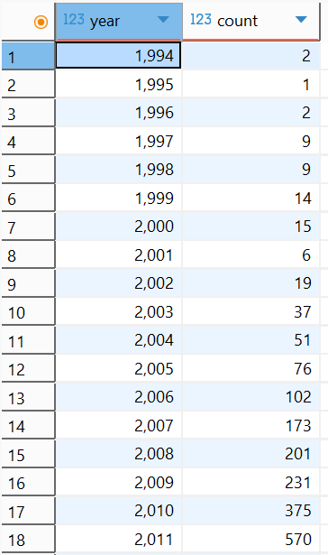
			- 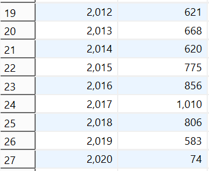{:height 301, :width 357}
			- Years 1994-2020 are included in the dataset.
			- **Top 5 with most counts:**
			- 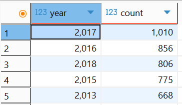
		- fuel
			- 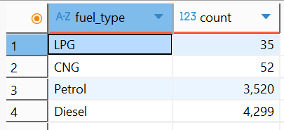
		- seller_type
			- 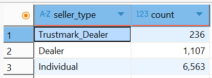
		- transmission
			- 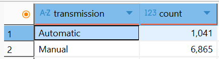
		- owner_type
			- 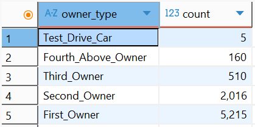
		- engine
			- 
			- 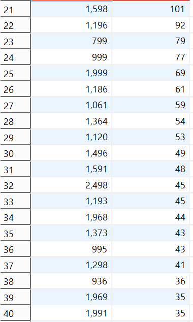
		- seats
			- 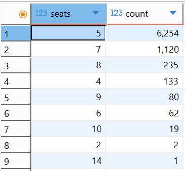
	- Category combinations
		- year + (transmission + fuel)
			- year + transmission + fuel
				- 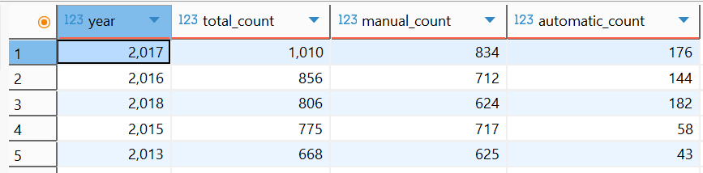
			- transmission + fuel
				- 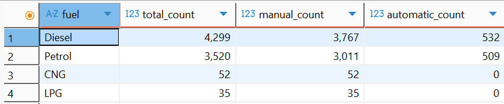
		- transmission + owner_type
			- 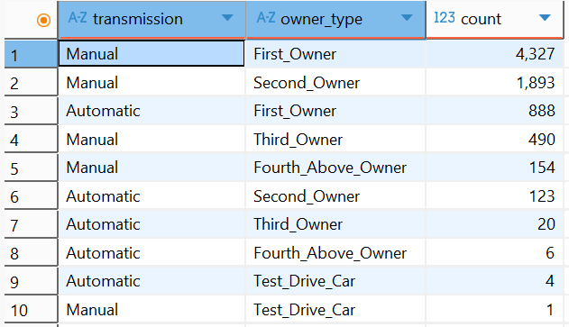
			- 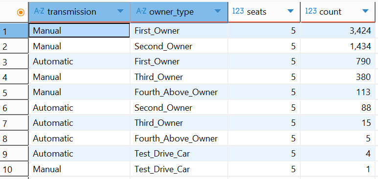
		- engine + transmission counts when
		  seller_type = individual
		  owner = first_owner
		  fuel = diesel
		  seats = 5
			- 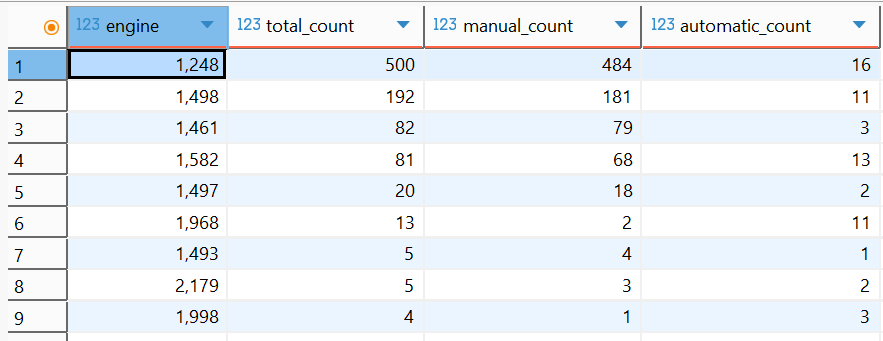
- Min/max values
	- selling_price & km_driven
		- manual
			- 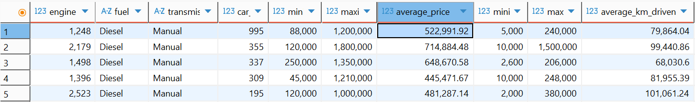
		- automatic
			- 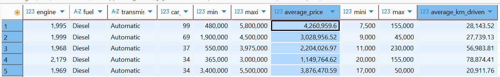
